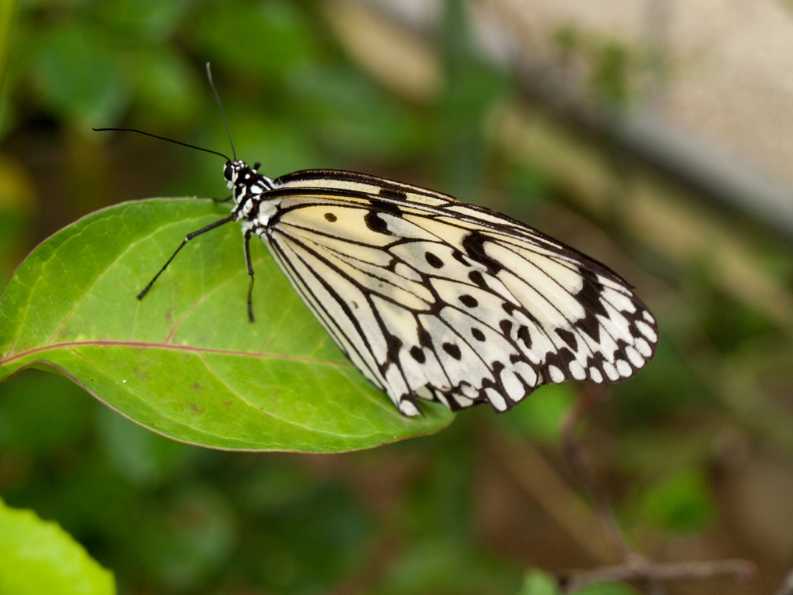

Example Images
==============

This directory contains example WebP encoded files and PNG source files.

## Image Credits

### Photos by Author

These images are taken by author.
These photos are licensed under the Creative Commons Attribution 3.0.
You can also use these images under the same as [go-libwebp's license](../LICENSE).

#### cosmos.png

The cosmos taken in Nokono-shima (Nokono Island), Fukuoka, JAPAN.


WebP file is generated by following command:

```sh
$ cwebp -q 90 cosmos.png -o cosmos.webp
Saving file 'cosmos.webp'
File:      cosmos.png
Dimension: 1024 x 768
Output:    76954 bytes Y-U-V-All-PSNR 45.87 47.63 48.10   46.44 dB
block count:  intra4: 2972
intra16: 100  (-> 3.26%)
skipped block: 1 (0.03%)
bytes used:  header:            249  (0.3%)
mode-partition:  15161  (19.7%)
Residuals bytes  |segment 1|segment 2|segment 3|segment 4|  total
macroblocks:     |       0%|      11%|      33%|      54%|    3072
quantizer:       |      12 |      11 |       9 |       8 |
filter level:    |       4 |       2 |       2 |       4 |
```

#### butterfly.png

The butterfly taken in Ishigaki-jima (Ishigaki Island) in Okinawa, JAPAN.



WebP file is generated by following command:

```sh
$ cwebp -q 90 butterfly.png -o butterfly.webp
Saving file 'butterfly.webp'
File:      butterfly.png
Dimension: 1024 x 768
Output:    79198 bytes Y-U-V-All-PSNR 45.50 48.71 49.90   46.44 dB
block count:  intra4: 2775
intra16: 297  (-> 9.67%)
skipped block: 0 (0.00%)
bytes used:  header:            383  (0.5%)
mode-partition:  13227  (16.7%)
Residuals bytes  |segment 1|segment 2|segment 3|segment 4|  total
macroblocks:     |       1%|       7%|      14%|      75%|    3072
quantizer:       |      12 |      12 |      10 |       8 |
filter level:    |       4 |       3 |       2 |       6 |
```

#### kinkaku.png

Kinkaku taken in Kyoto, JAPAN.


WebP file is generated by following command:

```sh
$ cwebp -q 90 kinkaku.png -o kinkaku.webp
Saving file 'kinkaku.webp'
File:      kinkaku.png
Dimension: 1024 x 768
Output:    186300 bytes Y-U-V-All-PSNR 43.86 47.25 48.26   44.81 dB
block count:  intra4: 2775
intra16: 297  (-> 9.67%)
skipped block: 243 (7.91%)
bytes used:  header:            425  (0.2%)
mode-partition:  16737  (9.0%)
Residuals bytes  |segment 1|segment 2|segment 3|segment 4|  total
macroblocks:     |       2%|      28%|      40%|      28%|    3072
quantizer:       |      12 |      11 |       9 |       6 |
filter level:    |       4 |       2 |       2 |       1 |
```

### From Google WebP Gallery

These images picked up from [WebP Gallery](https://developers.google.com/speed/webp/gallery) in Google Developers.

#### yellow-rose-3.png

"Free Stock Photo in High Resolution - Yellow Rose 3 - Flowers" by Jon Sullivan

This image is clipped by Google and licensed under [Creative Commons Attribution 3.0](https://creativecommons.org/licenses/by/3.0/). The Source of this image is in the public domain.

<div style="background:url('./checkerboard.png')">

</div>

#### fizyplankton.png

"baby tux for my user page" by Fizyplankton.

This image file is in the public domain.

<div style="background:url('./checkerboard.png')">

</div>
